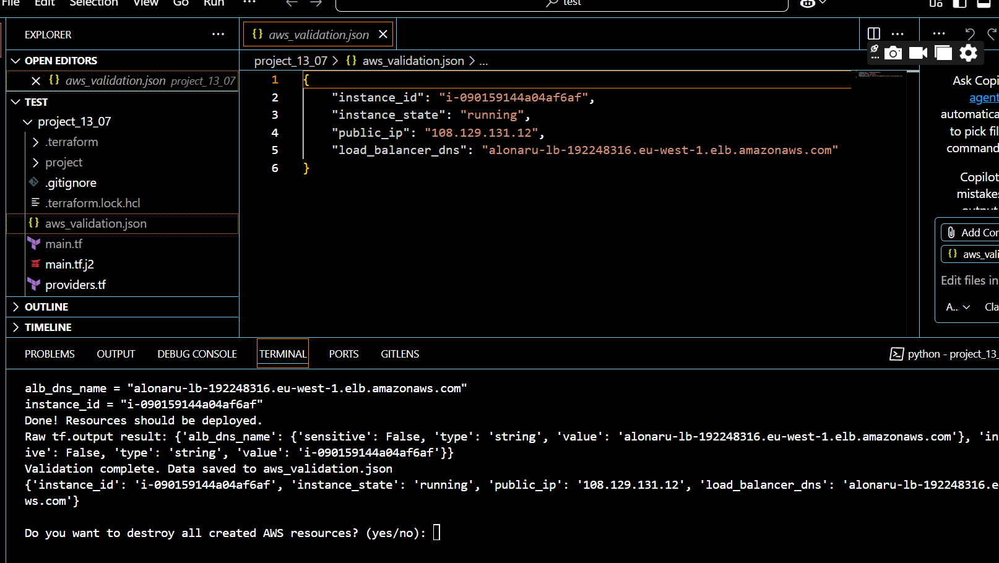
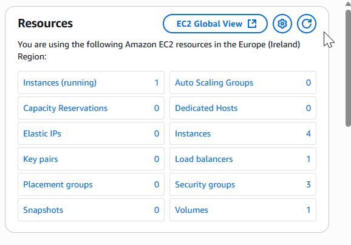
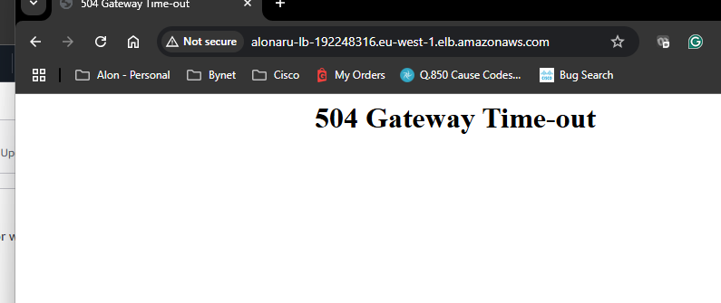

# 🚀 AWS EC2 + Application Load Balancer Automation with Terraform & Python

This project automates the creation and deployment of an EC2 instance and an Application Load Balancer (ALB) on AWS using **Terraform**, **Python**, and **Jinja2 templates**. It also includes resource validation and outputs key details to a JSON file.

---

## 📁 Project Structure

- `main.tf.j2` — Jinja2 template for your Terraform configuration  
- `main.tf` — file created after running the python script Rendered Terraform file  
- `aws_validation.json` — JSON file with instance ID, state, public IP, and ALB DNS  
- `py_create_ec2.py` — Python script to generate `main.tf`, run Terraform commands, and validate resources  
- `requirements.txt` — List of Python dependencies needed to run the script

---

## 🧰 Prerequisites

Before you start, make sure you have the following installed:

- [Python 3.x](https://www.python.org/downloads/)
- [Terraform CLI](https://developer.hashicorp.com/terraform/downloads)
- [AWS CLI](https://docs.aws.amazon.com/cli/latest/userguide/install-cliv2.html) with credentials configured
- Install Python packages:
  ```bash
  pip install -r requirements.txt
  ```

Example `requirements.txt`:
```
python-terraform
boto3
jinja2
```

---

## 🧠 What This Project Does

1. **Prompts user for input:**
   - Enter AWS region (e.g., `eu-west-1`)
   - Automatically uses two availability zones (e.g., `eu-west-1a` and `eu-west-1b`)
   - Choose AMI type (`ubuntu` or `amazon_linux`)
   - Select instance type (`t3.small` or `t3.medium`)
   - Enter load balancer name

2. **Generates a Terraform file** from a Jinja2 template, which:
   - Creates a new VPC, two public subnets (in different AZs), and an Internet Gateway
   - Sets up a route table for public internet access
   - Provisions an EC2 instance (with a public IP) in one subnet
   - Provisions an Application Load Balancer (ALB) across both subnets
   - Creates a security group allowing HTTP traffic
   - Attaches the EC2 instance to the ALB target group

3. **Validates AWS deployment using `boto3`**:
   - Checks EC2 instance status and retrieves its public IP
   - Verifies that the ALB is live and fetches its DNS name
   - Saves output data to `aws_validation.json` in JSON format
  
4. **Ask User to destroy the resources**
   - ask user to apply terraform destroy
   - if not the script ended

---

## 🧾 AWS Environment Configuration: Bash vs PowerShell

Before running the script, users must configure AWS credentials and region using environment variables. This ensures Terraform and boto3 can authenticate properly.

### 💻 Bash (Linux/macOS/WSL)

```bash
export AWS_ACCESS_KEY_ID="your-access-key-id"
export AWS_SECRET_ACCESS_KEY="your-secret-access-key"
export AWS_DEFAULT_REGION="us-east-2"
```

You can verify settings with:
```bash
echo $AWS_ACCESS_KEY_ID
```

To persist across sessions, add the exports to `.bashrc` or `.zshrc`.

---

### 🪟 PowerShell (Windows)

```powershell
$Env:AWS_ACCESS_KEY_ID = "your-access-key-id"
$Env:AWS_SECRET_ACCESS_KEY = "your-secret-access-key"
$Env:AWS_DEFAULT_REGION = "us-east-2"
```

To verify:
```powershell
echo $Env:AWS_ACCESS_KEY_ID
```

To make permanent, add these to your PowerShell profile or system environment variables.

---

## 🔐 Required AWS Permissions

Before running the Terraform template, make sure your IAM user has the necessary permissions to provision and manage resources in AWS. At a minimum, the user should be allowed to:

- Launch, describe, and terminate EC2 instances
- Create and manage security groups
- Attach tags to AWS resources
- Create and manage Application Load Balancers (ALB), listeners, and target groups
- View VPC, subnet, and availability zone information
- Create service-linked roles for Elastic Load Balancing
- Read identity information (using STS and IAM read-only actions)
- (Optional) Access CloudWatch metrics for deployment validation

> ⚠️ Missing any of these permissions may result in Terraform apply errors or validation failures in your automation script.

---

## 🚨 User guide Instructions

1. Clone the project to your local machine.

2. **Before starting**, confirm that your AWS credentials are configured using the instructions above.

3. Run pip install -r requirements.txt

4. Run the script from the `project_13_07` directory:
   ```bash/ps
   python3 py_create_ec2.py
   ```

5. Follow the prompts to:
   - Enter the region you entered for the credentials
   - Choose an AMI (the default is Ubuntu)
   - Pick an instance type (the default is t3.small)
   - Provide a name for the load balancer

6. After successful deployment:
   - Terraform file `main.tf` will be created
   - AWS resources will be provisioned
   - Outputs saved in `aws_validation.json`
  
7. Choose if you want to destroy the resources using terraform Destroy

---

## 📦 Outputs

- EC2 Instance ID
- ALB DNS name
- Instance state and public IP  
_All saved to `aws_validation.json`_

---

## 🧹 Cleanup
- you can choose to delete the resources at the end of the script right after succesfully create them or choose To delete all resources manually after running the script:
```bash
terraform destroy
```

---

## 📌 Notes

- This project works well with AWS Free Tier accounts—be mindful of usage limits
- Make sure AMI IDs match your selected region
- Double-check quotas and security group rules before deploying in production

---
## ScreenShot of the final out put and the AWS Consule resources





Happy automating! 🎯
